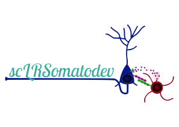
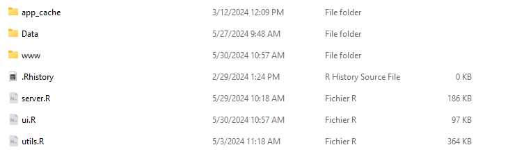

# scLRSomatoDev

<p align="center">
  <br>
    
  <br>
  <br>
</p>

## Introduction

scLRSomatoDev is a powerful Shiny application designed to explore and analyze ligand-receptor (LR) interactions in cortical development. This tool represents a significant advancement in understanding the molecular mechanisms underlying brain circuit assembly through large-scale single-cell transcriptomic analyses. With its intuitive design, scLRSomatoDev enables seamless exploration of complex biological data.

### Key Features

* Access detailed spatiotemporal transcriptional landscapes across neuronal subtypes
* Explore gene expression patterns and LR interactions at any developmental stage
* Predict and analyze LR interactions between different neuronal cell types

### Availability

We provide multiple installation options to suit your needs:

* Online version for quick access
* Local installation via RStudio
* Docker container for reproducible environments

## Table of Contents

1. [Getting Started](#getting-started)
   * [Minimum System Requirements](#minimum-system-requirements)
   * [Download Required Files](#download-required-files)
2. [Run scLRSomatoDev](#run-sclrsomatodev)
   * [Using the Online Version](#using-the-online-version)
   * [Using RStudio](#using-rstudio)
   * [Using Docker](#using-docker)
3. [Contact us](#contact-us)

## Getting Started

### Minimum System Requirements

  * Processor: 8+ cores (Intel/AMD)
  * Memory: 32GB RAM (64GB recommended for Docker)
  * Storage: 50GB+ free space
  * Display: 1920 x 1080 resolution or Higher
  * Operating System: Windows 10/11 (64-bit), macOS 10.15+, or Ubuntu 20.04+

### Download Required Files

1. **Download the project files**:
   * Click on the "Code" tab
   * Select "Download ZIP"
   * Extract the contents of the ZIP file to your desired location

2. **Download the required data**:
   * Visit our [Zenodo repository](inc)
   * Download the `data.zip` file
   * Extract the contents into your scLRSomatoDev folder
   * Verify your folder structure matches the following :

    <p align="center">
    <br>
      
    </p>

## Run scLRSomatoDev

### Using the Online Version

For easy use, we have set up a dedicated server running scLRSomatoDev that you can access online from anywhere in the world.

1. Visit our website: [sclrsomatodev.online](http://sclrsomatodev.online/)

2. Click on the "Try the app now!" button

3. Please read the following important message:

> [!CAUTION]
> Please note that the application page may take a few minutes to load. Your browser may display an error page at first ("no response from server"), but the app will load after a few moments. We are currently hosted on a server with limited resources, and appreciate your patience.

4. Wait for the server to load the app (this process can take several minutes as mentioned above)

5. Once the app is loaded and the "Overview" page appears, you're ready to start using scLRSomatoDev!

### Using RStudio

#### Prerequisites
* **RStudio**: If you don't have RStudio installed, please [download and install it](https://posit.co/download/rstudio-desktop/) before continuing.
* **Conda**: Make sure you have Conda installed on your system.

#### Setup Instructions

1. Create a conda environment using the provided environment file:
    ```{bash}
    conda env create -f environment_scLRSomatoDev.yml
    ```

2. Activate the environment:
    ```{bash}
    conda activate r_env
    ```

3. Open RStudio and set the working directory to the scLRSomatoDev folder.

4. Install the required R packages if they are not already installed:
    ```{r}
    install.packages(c("shiny", "tidyverse", "Seurat", "ggplot2", "dplyr", "tidyr"))
    ```
  
5. Run the Shiny app:
    ```{r}
    shiny::runApp("app.R")
    ```

6. The app will launch either in your default web browser or in the RStudio dedicated window.

### Using Docker

#### Prerequisites

* **Docker**: If you don't have Docker installed, please [download and install it](https://www.docker.com/products/docker-desktop/) before continuing.

#### Setup Instructions

1. Build the Docker image:
    ```{bash}
    docker build -t sclrshiny .
    ```
    The Docker image build process takes approximately 50 minutes, depending on your system.

3. Run the Docker container:
    ```{bash}
    docker run --rm -p 3838:3838 -v "/path/to/folder:/app" sclrshiny
    ```
    Replace "path/to/folder" with the path where your Data and www folders are located. For example, if the folders are located in "/home/user/Documents/Data_scLRSomatoDev", run:
    ```{bash}
    docker run --rm -p 3838:3838 -v "/home/user/Documents/Data_scLRSomatoDev:/app" sclrshiny
    ```

4. The app will be available at http://localhost:3838 after a few minutes.

> [!NOTE]
> You do not have to go through all these steps each time to launch the scLRSomatoDev shiny app. **You have to build the image only the first time**.
>
> For all subsequent times, you just have to **run the Docker image and copy the link to your web browser**.

## Contact us

